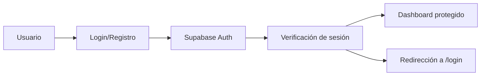

# 🏥 My Medical AI App

<div align="center">


**Aplicación web full stack para gestión y análisis inteligente de informes médicos**

_Desarrollada con Next.js, Supabase y OpenAI API_

[🚀 Demo en vivo](#) • [📖 Documentación](#) • [🐛 Reportar Bug](#) • [💡 Solicitar Feature](#)

</div>

---

## 📋 Tabla de Contenidos

- [✨ Características](#-características)
- [🛠️ Tecnologías](#️-tecnologías)
- [🚀 Instalación](#-instalación)
- [⚙️ Configuración](#️-configuración)
- [📁 Estructura del Proyecto](#-estructura-del-proyecto)
- [🔐 Autenticación](#-autenticación)
- [📊 Funcionalidades](#-funcionalidades)
- [☁️ Despliegue](#️-despliegue)
- [🛣️ Roadmap](#️-roadmap)
- [🤝 Contribuir](#-contribuir)
- [📄 Licencia](#-licencia)

---

## ✨ Características

<div align="center">

|         🔐 **Seguridad**          |     🤖 **Inteligencia Artificial**      |        📱 **UX Moderna**        |
| :-------------------------------: | :-------------------------------------: | :-----------------------------: |
| Autenticación segura con Supabase | Análisis automático de informes médicos | Interfaz responsiva y accesible |
|         Rutas protegidas          |      Procesamiento con OpenAI API       |      Componentes shadcn/ui      |
|       Encriptación de datos       |        Resultados en tiempo real        |       Animaciones suaves        |

</div>

---

## 🛠️ Tecnologías

### **Frontend**

- **Next.js 14** - App Router + Server Actions
- **TypeScript** - Tipado estático
- **Tailwind CSS** - Framework de estilos
- **shadcn/ui** - Componentes modernos y accesibles
- **Lucide React** - Iconografía consistente
- **Framer Motion** - Animaciones fluidas

### **Backend & Base de Datos**

- **Supabase** - Base de datos PostgreSQL + Auth
- **OpenAI API** - Análisis de texto médico
- **Server Actions** - API routes optimizadas

### **Deployment & Hosting**

- **Vercel** - Deploy automático y hosting
- **GitHub Actions** - CI/CD pipeline

---

## 🚀 Instalación

### **Prerrequisitos**

- Node.js 18+
- npm o yarn
- Cuenta en Supabase
- API Key de OpenAI

### **Pasos de instalación**

```bash
# 1. Clonar el repositorio
git clone https://github.com/AndrewUru/my-medical-ai-app.git

# 2. Entrar al directorio
cd my-medical-ai-app

# 3. Instalar dependencias
npm install

# 4. Configurar variables de entorno
cp .env.example .env.local

# 5. Iniciar servidor de desarrollo
npm run dev
```

🎯 **Accede a:** `http://localhost:3000`

---

## ⚙️ Configuración

### **Variables de Entorno**

Crea un archivo `.env.local` en la raíz del proyecto:

```env
# Supabase Configuration
NEXT_PUBLIC_SUPABASE_URL=your-supabase-project-url
NEXT_PUBLIC_SUPABASE_ANON_KEY=your-supabase-anon-key

# OpenAI Configuration
OPENAI_API_KEY=your-openai-api-key

# Optional: Analytics
NEXT_PUBLIC_GA_ID=your-google-analytics-id
```

### **Configuración de Supabase**

1. Crea un proyecto en [Supabase](https://supabase.com)
2. Configura las tablas necesarias (ver documentación)
3. Habilita autenticación por email
4. Configura políticas de seguridad RLS

### **Configuración de OpenAI**

1. Obtén tu API key en [OpenAI Platform](https://platform.openai.com)
2. Configura los modelos y parámetros en `lib/openai.ts`

---

## 📁 Estructura del Proyecto

```
my-medical-ai-app/
├── 📂 app/                    # App Router (Next.js 14)
│   ├── 📂 api/               # API Routes
│   │   └── 📂 analyze/       # Endpoint de análisis
│   ├── 📂 dashboard/         # Área privada
│   │   ├── 📂 results/       # Página de resultados
│   │   └── 📂 upload/        # Página de subida
│   ├── 📂 login/             # Autenticación
│   └── 📄 layout.tsx         # Layout principal
├── 📂 components/            # Componentes reutilizables
│   ├── 📂 ui/               # Componentes shadcn/ui
│   └── 📄 *.tsx             # Componentes personalizados
├── 📂 lib/                   # Utilidades y configuraciones
│   ├── 📄 supabaseClient.ts  # Cliente Supabase
│   ├── 📄 supabaseAdmin.ts   # Admin Supabase
│   └── 📄 utils.ts           # Funciones utilitarias
├── 📂 public/                # Assets estáticos
├── 📂 styles/                # Estilos globales
└── 📄 package.json           # Dependencias
```

---

## 🔐 Autenticación

### **Flujo de Autenticación**



### **Características de Seguridad**

- ✅ **Autenticación por email** con Supabase
- ✅ **Rutas protegidas** con middleware
- ✅ **Sesiones persistentes**
- ✅ **Redirección automática** para usuarios no autenticados
- ✅ **Políticas RLS** en base de datos

---

## 📊 Funcionalidades

### **🎯 Funcionalidades Principales**

| Funcionalidad             | Estado | Descripción                        |
| :------------------------ | :----: | :--------------------------------- |
| 🔐 **Autenticación**      |   ✅   | Login/registro seguro con Supabase |
| 📄 **Subida de archivos** |   ✅   | Carga de informes médicos          |
| 🤖 **Análisis IA**        |   ✅   | Procesamiento con OpenAI           |
| 📈 **Visualización**      |   ✅   | Gráficos y estadísticas            |
| 📱 **Responsive**         |   ✅   | Diseño adaptativo                  |
| 🎨 **UI Moderna**         |   ✅   | Componentes shadcn/ui              |

### **🔧 Funcionalidades Técnicas**

- **Server Actions** para operaciones del servidor
- **Optimistic Updates** para mejor UX
- **Error Boundaries** para manejo de errores
- **Loading States** con skeleton components
- **Toast Notifications** para feedback

---

## ☁️ Despliegue

### **Deploy en Vercel (Recomendado)**

[](https://vercel.com/new/clone?repository-url=https://github.com/AndrewUru/my-medical-ai-app)

#### **Pasos automáticos:**

1. **Conecta tu repositorio** de GitHub con Vercel
2. **Configura las variables de entorno** en el dashboard
3. **Deploy automático** en cada push a main

#### **Variables de entorno en Vercel:**

```bash
NEXT_PUBLIC_SUPABASE_URL=your-supabase-url
NEXT_PUBLIC_SUPABASE_ANON_KEY=your-supabase-key
OPENAI_API_KEY=your-openai-key
```

### **Deploy Manual**

```bash
# Build para producción
npm run build

# Iniciar servidor de producción
npm start
```

---

## 🛣️ Roadmap

### **🚀 Próximas Funcionalidades**

- [ ] 📊 **Gráficas avanzadas** con filtros por fechas
- [ ] 👤 **Perfil de usuario** y preferencias
- [ ] 📧 **Notificaciones por email**
- [ ] 🔍 **Búsqueda avanzada** de informes
- [ ] 📱 **App móvil** con React Native
- [ ] 🤖 **Chatbot médico** integrado

### **🔧 Mejoras Técnicas**

- [ ] ⚡ **Optimización de rendimiento**
- [ ] 🧪 **Tests automatizados**
- [ ] 📈 **Analytics avanzados**
- [ ] 🔒 **Auditoría de seguridad**
- [ ] 🌐 **Internacionalización (i18n)**

---

## 🤝 Contribuir

¡Las contribuciones son bienvenidas!

### **Cómo contribuir:**

1. **Fork** el proyecto
2. **Crea** una rama para tu feature (`git checkout -b feature/AmazingFeature`)
3. **Commit** tus cambios (`git commit -m 'Add some AmazingFeature'`)
4. **Push** a la rama (`git push origin feature/AmazingFeature`)
5. **Abre** un Pull Request

### **Guías de contribución:**

- 📝 **Código limpio** y bien documentado
- 🧪 **Tests** para nuevas funcionalidades
- 📖 **Documentación** actualizada
- 🎨 **Consistencia** en el diseño

---

## 📄 Licencia

Este proyecto está bajo la Licencia MIT. Ver el archivo `LICENSE` para más detalles.

---

## 👨‍💻 Autor

<div align="center">

**AndrewUru**

[](https://github.com/AndrewUru)
[](https://linkedin.com/in/andrewuru)
[](https://twitter.com/andrewuru)

_Desarrollador Full Stack_

</div>

---

## ⚠️ Disclaimer

> **Importante:** Esta aplicación está en fase de desarrollo activo. No se recomienda su uso en entornos clínicos reales sin la validación profesional correspondiente. Los resultados del análisis de IA son informativos y no reemplazan el diagnóstico médico profesional.

---

<div align="center">

**⭐ Si este proyecto te ayuda, ¡dale una estrella!**

_Construido con ❤️ para la comunidad médica_

</div>
